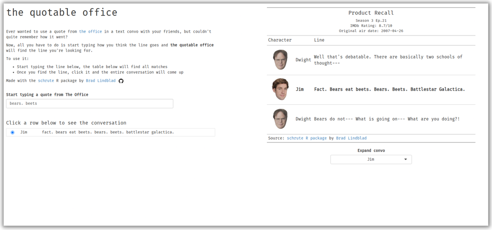

<!-- README.md is generated from README.Rmd. Please edit that file -->

```{r, include = FALSE}
knitr::opts_chunk$set(
  collapse = TRUE,
  comment = "#>",
  fig.path = "man/figures/README-",
  out.width = "100%"
)
```

# the quotable office

<!-- badges: start -->

[](https://github.com/bradlindblad/QuotableOffice/actions/workflows/R-CMD-check.yaml) [](https://app.codecov.io/gh/bradlindblad/QuotableOffice?branch=main)

<!-- badges: end -->

The quotable office is an [R shiny](https://shiny.rstudio.com/) app that leverages the [schrute R package](https://bradlindblad.github.io/schrute/) to help you find quotes from [the office](https://www.imdb.com/title/tt0386676/) given just a snippet of the line.

-   Use the live app at <https://bradleylindblad.shinyapps.io/quotableoffice>

-   Check out the project on [RStudio Cloud](https://rstudio.cloud/content/4740431)



## Usage

Enter a partial quote in the input box on the left side of the app. The table below will populate all the partial matches. Once you think you have found your match, click that row and the conversation will populate the table on the right.

## Installation

Install directly from Github

``` r
devtools::install_github('bradlindblad/quotableoffice')
```

You can install the development version of QuotableOffice like so:

``` r
devtools::install_github('bradlindblad/quotableoffice', ref = "dev")
```

## Methods

This is a Shiny app that uses the [golem](https://engineering-shiny.org/golem.html) framework. The data from my [schrute](https://bradlindblad.github.io/schrute/) package is piped to a {reactable} table, before finally arriving at a carefully-formatted {gt} table.

## Learning more

Julia Silge and David Robinson, creators of the [tidyText](https://www.tidytextmining.com/) both used the {schrute} package for a TidyTuesday analysis. Watch their videos and learn from the masters:

-   [David Robinson (Youtube)](https://www.youtube.com/watch?v=_IvAubTDQME&t=1092s)

-   [Julia Silge (Youtube)](https://www.youtube.com/watch?v=R32AsuKICAY)

The awesome [tidytuesday.rocks](https://nsgrantham.shinyapps.io/tidytuesdayrocks/) shiny app also aggregates 80 + sweet data visualizations that use the {schrute} package powering this app.

## Other languages

This dataset is also available in

-   [python](https://github.com/bradlindblad/schrutepy)

-   [julia](https://github.com/bradlindblad/Schrute.jl)
